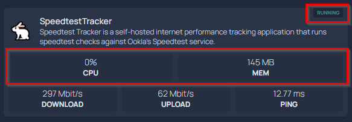

TrueCharts has adopted `Homepage` as its default dashboard application due to its support for Kubernetes.

This guide will cover how to use the TrueCharts/Homepage integration included in the charts.
Editing the configuration .yaml files of homepage can be done if you add the codeserver addon to your deployment.
This guide will not cover every aspect of options available to Homepage. For more information, please visit the following links:

GitHub: <https://github.com/gethomepage/homepage> <br>
Website: <https://gethomepage.dev/>

:::caution[INGRESS REQUIRED]
For Homepage to "discover" your apps, Ingress is required using our ingress configuration guidelines and the integration options for the chart configuration. Otherwise, all Kubernetes features can be used with manual configuration of Homepage via its configuration YAML files.
:::

## Cluster/Node/Charts resources

To add the cluster/node resources display, add the following to your `/app/config/widgets.yaml` file:

```yaml
- kubernetes:
    cluster:
      # Shows cluster-wide statistics
      show: true
      # Shows the aggregate CPU stats
      cpu: true
      # Shows the aggregate memory stats
      memory: true
      # Shows a custom label
      showLabel: true
      label: "ChangeMe"
    nodes:
      # Shows node-specific statistics
      show: false # Set to True in Clustered Kubernetes environments
      # Shows the CPU for each node
      cpu: true
      # Shows the memory for each node
      memory: true
      # Shows the label, which is always the node name
      showLabel: true
```

This will result in the following being added:


Metrics are standard enabled per widget and can be shown in the widgets by clicking on top right corner. When prefered this can be changed in `/app/config/widgets.yaml`:



:exclamation: Due to how Homepage calculates utilization for your applications, this is only an approximation. The percentage is not based on your physical CPU utilization but on the max CPU limit for the chart and is additive for each pod. If your chart has a 2000m CPU limit and has 1 pod, 1000m of usage will read as 50%. If the chart has 2 pods each with a 2000m limit, it will read as 25% for 1000m of usage as the pods total 4000m. RAM utilization is the total combined RAM usage across all pods.

## Enabling Integration in Charts

To enable the integration for a chart you need to add the homepage addon to the ingress section.
Detailed configuration details: https://trueforge.org/common/ingress/homepage/

- **name** can be left blank to use the charts deployment name or use the name of your choice.
- **description** can be left blank for using the chart description of TrueCharts or you can use the description of your choice.
- **icon** can be left blank for using the chart icon or link to the icon of your choice.
- **group** This is important and required. It will allow you to group different apps together. For example, all your media apps may be in a group called "Media". You can also use the group names you may have already defined in `/app/config/services.yaml`, and it will add the discovered app to that group.
- **weight** can be left blank or set a number to define an order per category.
- **widget.enabled**: If the app does not have a widget option set, set this to `false`.
- **widget.custom.key**: This is where you will enter an API key for your application if needed. If this is a new install and you do not have an API key yet, you can come back and add this later.
- **Custom-Options** Adding custom options will allow you to add fields to the widget, or define username/password when there is no API key to apply. You can see the various fields available in the widgets section of the Homepage documentation at their site above.

Example:

```yaml
ingress:
  main:
    integrations:
      homepage:
        enabled: true
        group: "Arr"
        weight: 1
        widget:
          custom:
            key: "${HP_API_SONARR}"
```

Which results in the following in Homepage:


As you can see, the application is running and the fields have populated.

## Other settings
You can modify `/app/config/settings.yaml` to change the group layout from a single column to rows (with up to 5 columns per row), weather details and much more other settings.

## Known Issues and Limitations

- When using the integration to detect your apps, applications may change places within the group on each restart of Homepage as it populates in the order it detects the application.
- Some applications may have an incorrect widget type. Please open a bug report on our [GitHub](https://github.com/truecharts/charts/issues).
- When using the integration, you will not be able to control settings on a per-app basis as far as auto showing/hiding stats, changing the status indicator, or adding a ping with ms response time readout.
- External Services are not supported at this time.
- If you define a group in services.yaml, it must contain at least one manual entry. Otherwise, it will interfere with widget API calls and cause an API JSON error.
- Custom-App will report Pod Status and stats but has no widget support at this time.
