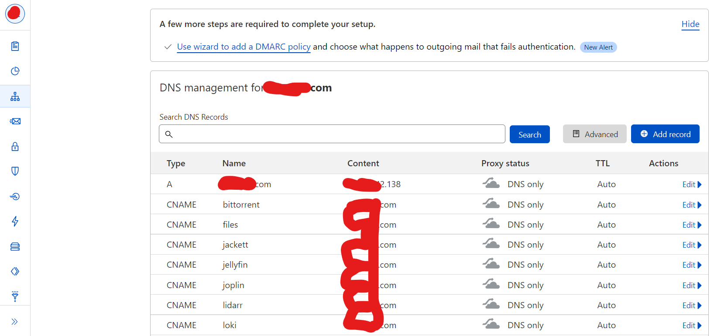

This guide will help you go through the steps to use Cloudflareddns to update your dynamic IP along with your entire deployment, so that even if you change IP your domain will point to the right address.

## Prerequisites

This guide assumes you've followed our [clusterissuer guide](/charts/stable/clusterissuer/how-to) with your domain and done the configuration for your DNS on Cloudflare

The recommended way is to setup CNAMEs for your subdomains (charts) and keep your A record pointed to your base domain, such as below



## Create an API Token

In case you haven't created an api token yet, create one as follows.

In your profile, go to **API Tokens** and click **Create Token**, then select **Use Template** for **Edit zone DNS**.

Permissions

- Zone - DNS - Edit
- Zone - Zone - Read

And the following Zone resources

- Include - Specific zone - yourdomain.com


## Cloudflareddns Chart Setup

Use the API Token previously created for the **api_token** field.

- Change **domain** to your DNS Zone A record (yourdomain.com)
- Change **record** to 'A' if you're only changing your main domain
- Change **zone** to DNS Zone ID found on the Cloudflare Overview Page for your domain.

An example configuration could look like that:

```yaml
values:
  cloudflareddns:
    api_token: ${DOMAIN_0_CLOUDFLARE_TOKEN}
    host_zone_record:
      - domain: ${DOMAIN_0}
        record: A
        zone: ${DOMAIN_0}
```

If you're using or changing specific A records or CNAMEs you may want to refer to the upstream documentation for more examples [here](https://hotio.dev/containers/cloudflareddns/))
